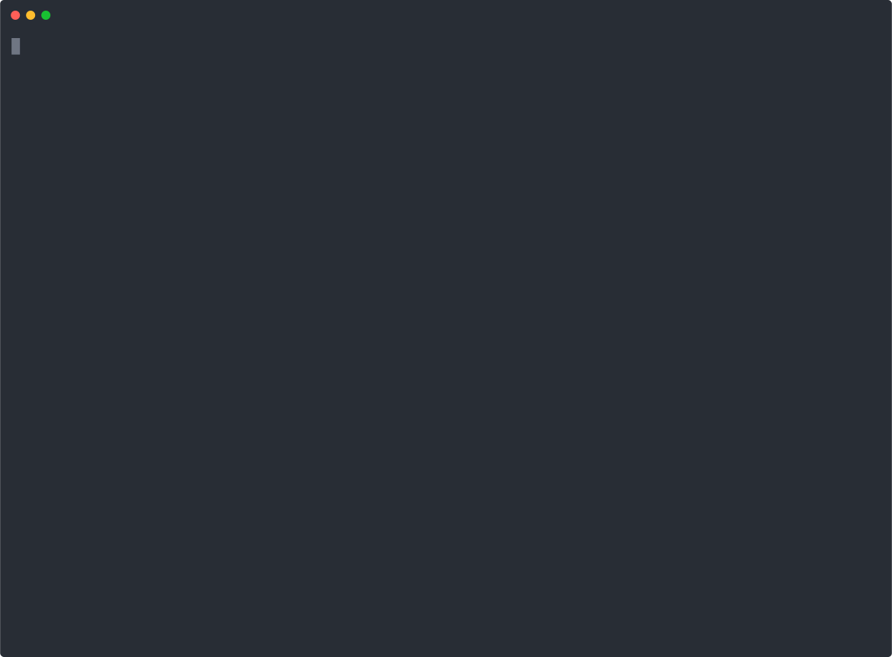

<div align="center">

# color-converter.nvim


[Features](#features) • [Install](#install) • [Usage](#usage) • [Contribute](#contribute)


  
</div>

Easily convert your CSS colors without leaving your favorite editor.

## Features

- Cycle between HEX, RGB and HSL or directly convert to one of them, e.g. from RGB to HEX.
- No external dependencies!

## Install

Packer
```lua
use 'NTBBloodbath/color-converter.nvim'
require('color-converter').setup({})
```

Lazy
```lua
return {
  "NTBBloodbath/color-converter.nvim",
  opts = {},
}
```

## Usage

Just configure the [commands](#commands), place the cursor over the line
containing the CSS color and trigger the command that you want.

### Commands

`color-converter.nvim` respects your keyboard shortcuts, so it doesn't create
any by default. Instead, expose commands so you can create keyboard shortcuts
yourself. These commands are the following:

- `<Plug>ColorConvertCycle`
  - Cycle between `HEX`, `RGB` and `HSL`.
- `<Plug>ColorConvertHEX`
  - Convert the current color to `HEX`.
- `<Plug>ColorConvertRGB`
  - Convert the current color to `RGB`.
- `<Plug>ColorConvertHSL`
  - Convert the current color to `HSL`.

### Configuration
  This is the default configuration:

```lua
{
  hsl_pattern = "hsl([h]deg [s] [l])",
  hsla_pattern = "hsl([h]deg [s] [l] / [a]%)",
  rgb_pattern = "rgb([r] [g] [b])",
  rgba_pattern = "rgb([r] [g] [b] / [a]%)",
}
```

#### Patterns
HSL/RGB colors can be expressed in many different ways, it's therefore possible
to configure which one to use when generating/converting colors.

This plugin aims to correctly convert HSL/RGB colors regardless of which syntax
was used to write them. However one has to be chosen when generating a new
color.

See [hsl()](https://developer.mozilla.org/en-US/docs/Web/CSS/color_value/hsl) and [rgb()](https://developer.mozilla.org/en-US/docs/Web/CSS/color_value/rgb) for more information.

The following rules apply to the color patterns:
- Only known tokens will be replaced, unknown tokens and text oustide `[]` will be kept as is.
  The following tokens are supported: `[h]`, `[s]`, `[l]`, `[r]`, `[g]`, `[b]`, `[a]`.
- You can add the `%` suffix to any token to represent the value as a percentage.

Example patterns (example values are included for clarity):
- `hsl([h:180]deg [s:0] [l:50] / [a:0.5]%)` -> `hsl(180deg 0 50 / 50%)`
- `hsl([h:180] [s:0]% [l:50]% / [a:0.5])` -> `hsl(180 0% 50% / 0.5)`
- `hsl([h:180]deg, [s:0], [l:50])` -> `hsl(180deg, 0, 50)`
- `rgb([r:255] [g:0] [b:0] / [a:0.5]%)` -> `rgb(255 0 0 / 50%)`
- `rgb([r:255]% [g:0]% [b:0]% / [a:0.5])` -> `rgb(100% 0% 0% / 0.5)`
- `rgb([r:255], [g:0], [b:0])` -> `rgb(255, 0, 0)`

## Acknowledgements

- VSCode for the idea and some of the converters

## Contribute

1. Fork it (https://github.com/NTBBloodbath/color-converter.nvim/fork)
2. Create your feature branch (<kbd>git checkout -b my-new-feature</kbd>)
3. Commit your changes (<kbd>git commit -am 'Add some feature'</kbd>)
4. Push to the branch (<kbd>git push origin my-new-feature</kbd>)
5. Create a new Pull Request

## Todo

- [x] Support RGBA and HSLA
- [ ] Proper support for HEX with Alpha field (`#RRGGBBAA`)
- [ ] Add a command to select the conversion in a floating window

## License

`color-converter.nvim` is distributed under [MIT license](./LICENSE).
